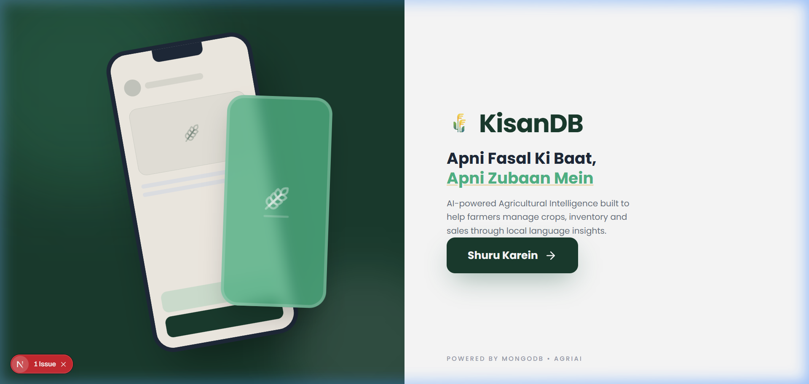
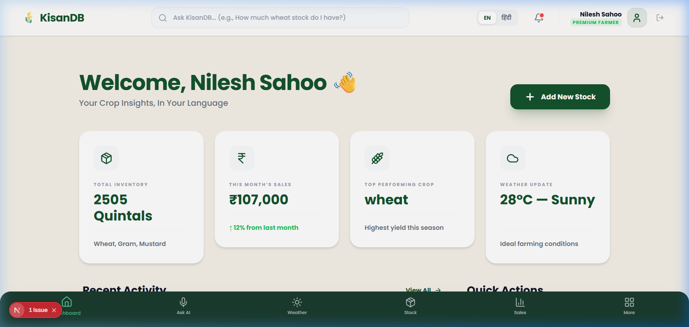
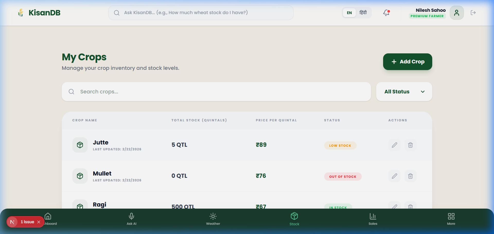
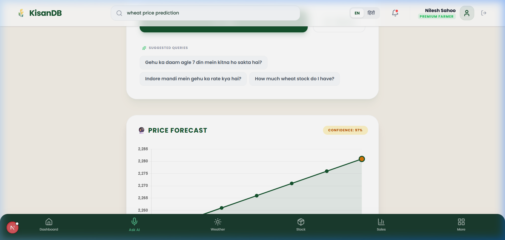
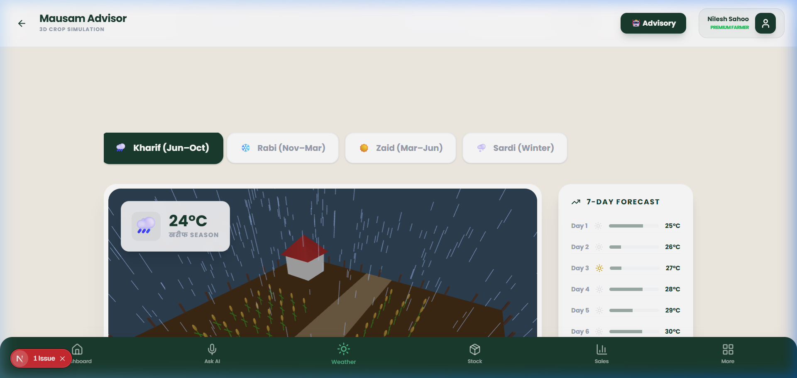

<div align="center">

# 🌾 KisanDB — Apni Fasal Ki Baat, Apni Zubaan Mein

**AI-Powered Agricultural Intelligence for Indian Farmers**

*Manage crops, inventory, and sales through local language insights — Hindi/English bilingual*

[](https://nextjs.org/)
[](https://www.mongodb.com/)
[](https://flask.palletsprojects.com/)
[](https://groq.com/)
[]()

</div>

---

## 📸 Screenshots

### 🏠 Landing Page
> The welcoming splash page with KisanDB branding — "Apni Fasal Ki Baat, Apni Zubaan Mein" (Your crop's story, in your own language).



### 📊 Farmer Dashboard
> Personalized dashboard showing total stock, monthly sales revenue, best-performing crop, and live weather — all in Hindi. Quick actions for adding stock and viewing sales.



### 🌾 Crop Inventory Manager
> Full crop management system with stock levels, per-quintal pricing, and status alerts (कम स्टॉक / Stock OK). Add, edit, and delete crops with real-time search and filters.



### 📈 AI Price Forecast
> Polynomial regression-based price predictions with 7-day forecasts. Shows the **best day to sell** and **expected price** with confidence scores. Powered by the custom ML engine.



### 🌦️ Mausam Advisor — 3D Weather Simulation
> Interactive 3D farm simulation with real-time weather effects (rain, clouds, snow). Includes a 7-day forecast, crop calendar, and AI-powered farming advisories.



---

## ✨ Features

### 🤖 AI-Powered Query System
- **Natural Language Queries** — Ask questions in Hindi or English  
  *"Mere paas kitna gehu hai?"* → Instantly queries MongoDB and responds
- **Groq + Llama 3.3 70B** — Converts natural language to MongoDB aggregation pipelines
- **Smart Intent Detection** — Automatically identifies crop names, time periods, and query types

### 📊 Dashboard & Analytics
- **Real-time Stats** — Total stock, monthly sales, best crop, weather at a glance
- **Activity Timeline** — Recent crop additions, sales, and price updates
- **Quick Actions** — One-tap stock addition and sales recording
- **Bilingual UI** — Toggle between हिंदी and English seamlessly

### 🌾 Crop & Inventory Management
- **Full CRUD** — Add, edit, delete crops with stock quantities and pricing
- **Status Tracking** — Auto-detection of low stock, out-of-stock, and healthy levels
- **Search & Filter** — Find crops instantly with real-time filtering
- **Per-Quintal Pricing** — Track market-aligned pricing for each crop

### 📈 Price Prediction Engine
- **Polynomial Regression** — Custom-built quadratic model (`y = ax² + bx + c`)
- **7-Day Forecasts** — Predict future prices with confidence percentages
- **Best Sell Recommendations** — AI tells farmers the optimal day and price to sell
- **R² Confidence Score** — Statistical accuracy indicator for each prediction

### 🏪 Live Mandi Prices
- **Government API Integration** — Real-time data from `data.gov.in` (4,367+ mandis)
- **State Comparison** — Compare average prices across all Indian states
- **Best Mandi Finder** — Identifies the highest-paying mandi for any crop
- **Price Trend Analysis** — Daily change percentage with up/down indicators
- **Hindi Advisory** — AI-generated selling advice in Hindi

### 🌦️ Mausam Advisor (Weather)
- **3D Farm Simulation** — Interactive WebGL scene with dynamic weather effects
- **7-Day Forecast** — Temperature predictions with weather icons
- **Crop Calendar** — Monthly planting guide with seasonal recommendations
- **AI Advisory** — Context-aware farming tips based on weather conditions
- **3 Weather Modes** — Clear, Cloudy, and Snow simulations

### 💰 Loan & Subsidy Checker
- **10+ Government Schemes** — PM-KISAN, KCC, Fasal Bima, and state-level schemes
- **Auto-Eligibility Check** — Instant matching based on farmer profile
- **Document Checklist** — Required papers listed in Hindi & English
- **Deadline Alerts** — Urgent scheme notifications
- **Direct Apply Links** — One-click access to official application portals

### 🛡️ Crop Insurance
- **PM Fasal Bima Integration** — Information and eligibility for crop insurance
- **Risk Assessment** — Climate-based risk evaluation

### 🔬 Soil Health Card
- **AI Soil Analysis** — Recommendations for soil improvement
- **Fertilizer Advice** — Personalized suggestions based on soil parameters

### 🔔 Smart Alert System
- **Low Stock Alerts** — Automatic notifications when inventory drops
- **Stale Inventory Detection** — Alerts for crops not updated in 15+ days
- **SMS Notifications** — Send scheme summaries and alerts via SMS
- **Bell Notifications** — In-app notification center

### 💹 Sales Tracking
- **Revenue Analytics** — Monthly sales breakdown and profit tracking
- **Crop-wise Reports** — Per-crop sales performance
- **Trend Visualization** — Charts showing sales over time

---

## 🏗️ Tech Stack

| Layer | Technology |
|-------|-----------|
| **Frontend** | Next.js 16, React 19, Tailwind CSS 4 |
| **AI/LLM** | Groq SDK + Llama 3.3 70B Versatile |
| **Database** | MongoDB Atlas (Mongoose ODM) |
| **ML Backend** | Python Flask + scikit-learn + pandas |
| **Data Source** | data.gov.in Official Government API |
| **3D Graphics** | HTML5 Canvas + Custom WebGL Renderer |
| **Auth** | JWT + bcrypt (custom auth system) |
| **Animations** | Framer Motion |
| **Icons** | Lucide React |
| **Charts** | Chart.js + react-chartjs-2 |

---

## 📁 Project Structure

```
kisandb/
├── app/                        # Next.js App Router Pages
│   ├── page.tsx                # Dashboard (home)
│   ├── layout.tsx              # Root layout with providers
│   ├── inventory/              # Crop inventory management
│   ├── sales/                  # Sales tracking & analytics
│   ├── weather/                # Mausam Advisor (3D weather)
│   ├── query/                  # AI natural language query page
│   ├── features/               # More features hub
│   ├── login/                  # Authentication - login
│   ├── signup/                 # Authentication - signup
│   └── api/                    # API Routes
│       ├── auth/               # Login, signup, user APIs
│       ├── crops/              # CRUD for crops
│       ├── sales/              # Sales recording
│       ├── mandi/              # Mandi price bridge
│       ├── query/              # AI query processing
│       ├── alerts/             # Notification & SMS APIs
│       └── data/               # Data import utilities
│
├── components/                 # React Components
│   ├── Header.tsx              # Top navigation bar
│   ├── BottomNav.tsx           # Mobile bottom navigation
│   ├── AppWrapper.tsx          # Layout wrapper
│   ├── SplashScreen.tsx        # Animated splash/loading
│   ├── WeatherFarm3D.tsx       # 3D weather simulation
│   ├── LiveMandiPrices.tsx     # Real-time mandi prices modal
│   ├── LoanSubsidyChecker.tsx  # Government scheme checker
│   ├── CropInsurance.tsx       # Crop insurance modal
│   ├── SoilHealthCard.tsx      # Soil health analysis modal
│   └── AlertBell.tsx           # Notification bell component
│
├── lib/                        # Core Logic & Services
│   ├── ai.ts                   # Groq/Llama AI integration
│   ├── weatherAgent.ts         # Multi-intent weather/crop agent
│   ├── prediction.ts           # Polynomial regression engine
│   ├── schemeEngine.ts         # Loan/subsidy eligibility engine
│   ├── alertEngine.ts          # Smart inventory alert system
│   ├── advisoryEngine.ts       # Farming advisory generator
│   ├── translations.ts         # Hindi/English translations
│   ├── weatherService.ts       # Weather API integration
│   ├── smsService.ts           # SMS notification service
│   ├── AuthContext.tsx          # Auth state management
│   ├── LanguageContext.tsx      # Language toggle context
│   ├── db.ts                   # MongoDB connection
│   ├── mongodb.ts              # MongoDB client singleton
│   └── auth.ts                 # JWT utilities
│
├── ml/                         # Python ML Pipeline
│   ├── step1_clean_load.py     # Data cleaning & MongoDB loading
│   ├── step2_train_model.py    # scikit-learn model training
│   ├── step3_api_server.py     # Flask prediction API
│   ├── mandi_live.py           # Live mandi price fetcher & API
│   ├── data/                   # Training datasets
│   ├── models/                 # Trained model files (.pkl)
│   └── requirements.txt        # Python dependencies
│
├── public/                     # Static assets
│   └── screenshots/            # App screenshots
│
├── hooks/                      # Custom React hooks
│   └── useWeatherData.ts       # Weather data fetching hook
│
└── scripts/                    # Utility scripts
```

---

## 🚀 Getting Started

### Prerequisites

- **Node.js** ≥ 18.x
- **Python** ≥ 3.9
- **MongoDB Atlas** account (or local MongoDB)
- **Groq API Key** (for AI features)

### 1️⃣ Clone the Repository

```bash
git clone https://github.com/your-username/kisandb.git
cd kisandb
```

### 2️⃣ Install Dependencies

```bash
# Frontend (Next.js)
npm install

# Backend (Python ML)
python -m venv venv
venv\Scripts\activate        # Windows
# source venv/bin/activate   # Mac/Linux
pip install -r ml/requirements.txt
```

### 3️⃣ Environment Setup

Create a `.env.local` file in the root directory:

```env
# MongoDB
MONGODB_URI=mongodb+srv://<username>:<password>@cluster0.xxxxx.mongodb.net/kisandb

# AI (Groq)
GROQ_API_KEY=your_groq_api_key_here

# Auth
JWT_SECRET=your_jwt_secret_here

# Weather (Optional)
WEATHER_API_KEY=your_openweather_api_key
```

### 4️⃣ Run the Application

**Terminal 1 — Next.js Frontend:**
```bash
npm run dev
# → http://localhost:3000
```

**Terminal 2 — Python Mandi API (optional):**
```bash
venv\Scripts\activate
python ml/mandi_live.py
# → http://localhost:5001
```

### 5️⃣ Open in Browser

Navigate to [http://localhost:3000](http://localhost:3000) and start exploring!

---

## 🧠 How It Works — Step by Step

### Step 1: Authentication
Farmers sign up with their name, state, crops, and land size. This profile powers all personalized features — scheme eligibility, AI queries, and dashboard stats.

### Step 2: Dashboard Overview
After login, the dashboard shows a summary — total stock in quintals, monthly sales revenue, best-performing crop, and current weather. Everything is displayed in the farmer's chosen language.

### Step 3: Crop Management
Farmers add their crops with quantities and per-quintal prices. The system tracks stock levels and auto-generates alerts when inventory is low or hasn't been updated in a while.

### Step 4: AI-Powered Queries
The "Ask AI" feature lets farmers type questions in natural Hindi — *"Kitna gehu bacha hai?"*. The system uses Groq's Llama 3.3 70B to convert this into a MongoDB query, fetch the data, and respond with advice.

### Step 5: Price Prediction
The prediction engine uses polynomial regression on historical mandi prices to forecast the next 7 days. It identifies the **best day to sell** and displays the expected price with a confidence score.

### Step 6: Live Mandi Prices
Real-time prices are fetched from the Indian Government's data.gov.in API covering 4,367+ mandis across India. Farmers can compare prices across states and find the highest-paying mandi for their crop.

### Step 7: Weather Advisory
The 3D Mausam Advisor provides an interactive farm simulation with real-time weather effects. It includes a 7-day forecast, seasonal crop calendar, and AI-generated farming tips based on current conditions.

### Step 8: Government Schemes
The Loan & Subsidy Checker automatically matches the farmer's profile against 10+ central and state government schemes (PM-KISAN, KCC, Fasal Bima, etc.), showing eligibility, required documents, and direct application links.

---

## 🔌 API Endpoints

### Next.js API Routes

| Method | Endpoint | Description |
|--------|----------|-------------|
| POST | `/api/auth/signup` | Register new farmer |
| POST | `/api/auth/login` | Login & get JWT |
| GET | `/api/auth/user` | Get current user profile |
| GET/POST | `/api/crops` | CRUD for crop inventory |
| GET/POST | `/api/sales` | Sales recording & analytics |
| POST | `/api/query` | AI natural language query |
| GET | `/api/alerts` | Fetch user notifications |
| POST | `/api/alerts/sms` | Send SMS notification |

### Python Flask API (Mandi Live)

| Method | Endpoint | Description |
|--------|----------|-------------|
| POST | `/mandi/live` | Fetch & analyze live mandi prices |
| GET | `/mandi/today/<commodity>` | Today's prices for a crop |
| GET | `/mandi/best/<commodity>` | Find highest paying mandi |
| GET | `/mandi/refresh/<commodity>` | Force refresh from govt API |

---

## 🤝 Contributing

Contributions are welcome! Please feel free to submit a Pull Request.

1. Fork the project
2. Create your feature branch (`git checkout -b feature/AmazingFeature`)
3. Commit your changes (`git commit -m 'Add AmazingFeature'`)
4. Push to the branch (`git push origin feature/AmazingFeature`)
5. Open a Pull Request

---

## 📄 License

This project is licensed under the MIT License.

---

<div align="center">

**Built with ❤️ for Indian Farmers**

*KisanDB — Powered by MongoDB + AgriAI*

</div>
